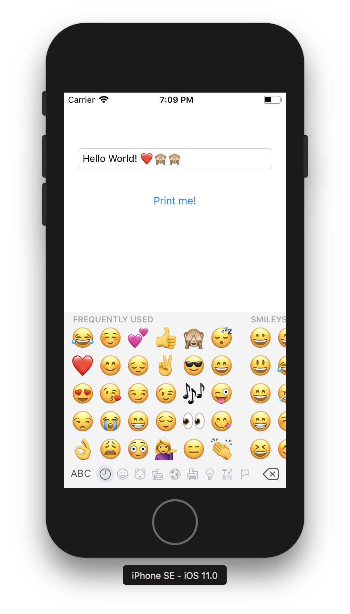
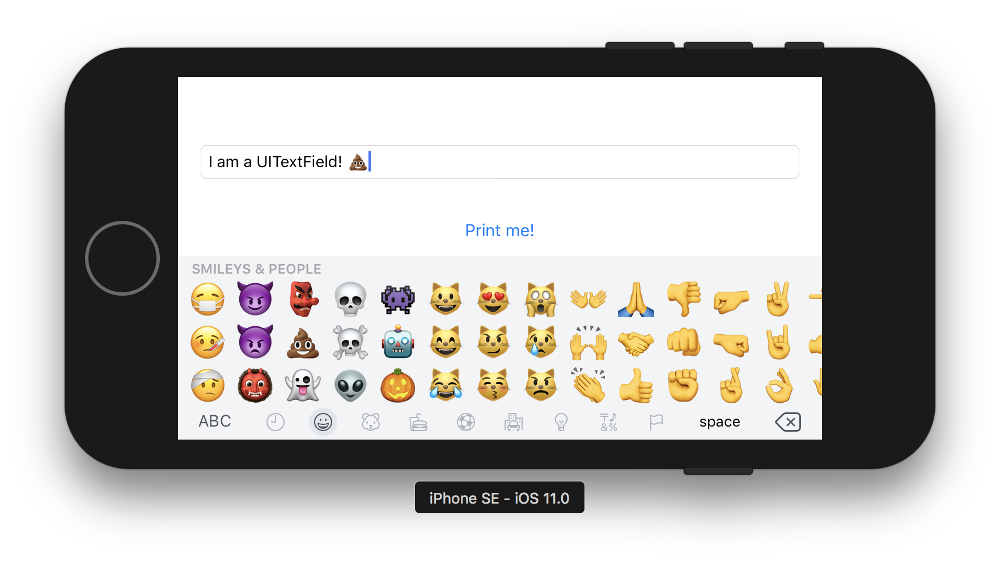

### Home Assignment #1

# HelloAutoLayout App

### Opis zadania

Celem zadania jest przygotowanie prostej aplikacji **HelloAutoLayout**. Apka składa się z jednego ekranu, na którym znajdują się dwa elementy.

Pierwszym elementem jest `UITextField` znajdujący się na samej górze ekranu. Jego odległość od góry ekranu (safe area) to **60pt**, a od każdego z boków (leading i trailing) po **20pt**.

Drugi element to `UIButton` zawierający tekst *Print me!*. Znajduje się poziomo na środku ekranu, oraz w odległości pionowej od dołu `UITextField`'a wynoszącej **30pt**.

Wciśnięcie `UIButton`'a powoduje wypisanie w konsoli zawartości `UITextField`'a. Jeśli `UITextField` jest pusty, w konsoli powinno się wypisać: *No text found!*.

Poniżej screenshoty, jak ma wyglądać gotowa aplikacja:

### Wskazówki

1. Po pierwsze stwórz pusty projekt w XCode. Otwórz plik Main.storyboard, i przeciągnij wszystkie potrzebne widoki do Twojego ViewControllera. Więcej informacji o edytorze Storyboard'ów znajdziesz [tutaj](http://help.apple.com/xcode/mac/current/#/dev31645f17f).
2. Po umieszczeniu wszystkich elementów na ekranie, dodaj odpowiednie constrainty, żeby pozycje elementów były poprawne. Więcej informacji o AutoLayoucie i dodawaniu Constraint'ów znajdziesz [tutaj](http://help.apple.com/xcode/mac/current/#/devc5759ad6f).
	- Tip 1: Zastanów się, jak opisałbyś layout językiem ludzkim. Spróbuj przełożyć to na constrainty.
	- Tip 2: Spróbuj uruchomić swoją aplikację na różnych symulatorach, oraz symulować obracanie ekranu. Sprawdź, czy Twoje widoki odpowiednio reagują na te zdarzenia.
3. Ostatnia rzecz to podpięcie odpowienich akcji i outletów w kodzie. Do tego potrzebujesz wykorzystać jedno **IBAction** (metoda z ViewControllera, która zostanie wykonana po wciśnięciu przycisku), oraz jeden **IBOutlet** – referncja do obiektu `UITextField` – w celu pobrania aktualnego tekstu z `UITextField`'a.
	- Tip 1: Przeczytaj dokładnie dokumentację o działaniu i podpinaniu IBOutlets oraz IBActions. Możesz je znaleźć odpowiednio [tutaj](http://help.apple.com/xcode/mac/current/#/devc06f7ee11) oraz [tutaj](http://help.apple.com/xcode/mac/current/#/dev9662c7670).
	- Tip 2: Żeby dostać się do tekstu znajdującego się w `UITextField`, użyj property `textField.text`.

### Kryteria oceny

1. Aplikacja się kompiluje i uruchamia na symulatorach
2. `UITextField` oraz `UIButton` poprawnie się pozycjonują na ekranie
3. `UITextField` dostosowuje swoją szerokość do szerokości ekranu przy rotacji urządzenia
4. Akcja przycisku jest poprawna
5. Layout jest stworzony z poprawnych constraintów

### Odpowiedzi

Odpowiedź (cały, spakowany w .zip folder projektu) wyślij mailem na adres [email](mailto:michal.dabrowski+assignment1@daftcode.pl) do końca najbliższej soboty: **04.11.2017, 23:59**.

Przypominam, że jest możliwość wykonania zadania w salce na MiMUW. Termin to **czwartek w godzinach 14:00 - 16:00**. Przyjdźcie w tym terminie – administratorzy uruchomią Wam system i będziecie mogli wykonać zadanie.
