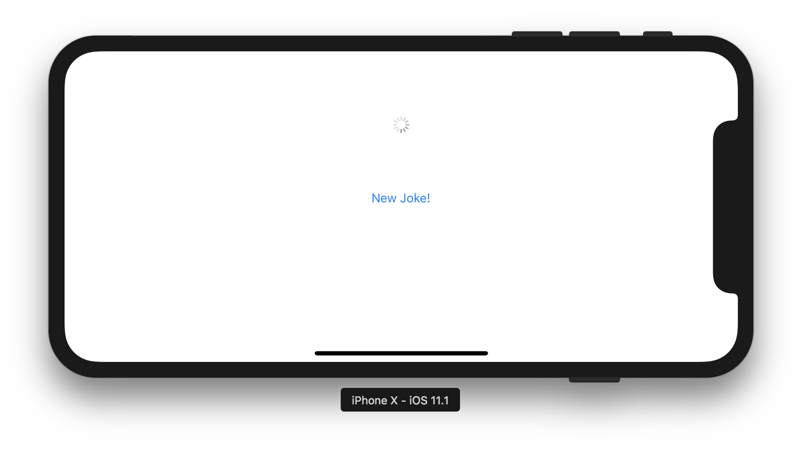
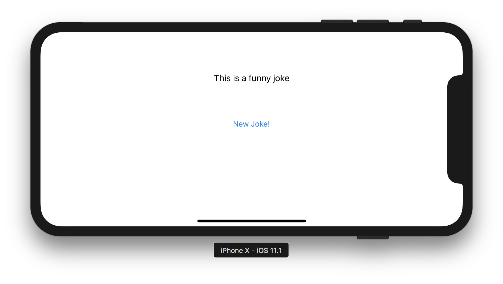

### Home Assignment #2

# Basic networking: Switter App part 1

### Opis zadania

Celem zadania jest stworzenie prostej aplikacji o nazwie Switter. Switter wykonuje (na razie) jedno zadanie – odzywa się do API i wyświetla dowcip.

Na ekranie aplikacji są trzy elementy:

1. `UILabel` zawierający treść ostatnio pobranego dowcipu
2. `UIButton` służący do pobrania nowego dowcipu
3. `UIActivityIndicator` pokazujący użytkownikowi, kiedy nowy dowcip jest pobierany.

Ułożenie elementów na ekranie dowolne. Pamiętaj jednak:

1. `UIActivityIndicator` jest widoczny i się animuje **jedynie** w czasie kiedy aplikacja pobiera nowy dowcip
2. W czasie pobierania dowcipu użytkownik nie powinien móc spróbować pobrać kolejnego dowcipu (tylko jeden request na raz)
3. W czasie pobierania dowcipu `UILabel` z dowcipem nie powinien być widoczny
4. Początkowo `UILabel` nie powinien zawierać żadnego tekstu

Dowcipy mają być pobierane z dedykowanego serwera. Wszytkie informacje dotyczące pobrania dowcipu są dostępne w dokumentacji serwera [tutaj](https://github.com/DaftMobile/switter).

### Wskazówki

1. Użyj `URLSession` do pobierania nowego dowcipu. Użyj konfiguracji `ephemeral`.
2. Użyj [`Codable`](https://developer.apple.com/documentation/foundation/archives_and_serialization/encoding_and_decoding_custom_types) (nowy feature Swifta 4) aby sparsować odpowiedź serwera
3. Przeczytaj [dokumentację serwera]((https://github.com/DaftMobile/switter)) i pamiętaj o headerze `x-device-uuid` - użyj API [`UIDevice`](https://developer.apple.com/documentation/uikit/uidevice) i metody `identifierForVendor`
4. Pamiętaj żeby **NIGDY** nie korzystać z funkcji `UIKit` w Background Queue
5. Jeżeli chcesz żeby `UILabel` sam złamał linię, kiedy nie mieści się na ekranie – zerknij na property `numberOfLines`

### Kryteria oceny

1. Używalny layout
2. Poprawne zachowanie
3. Poprawna konfiguracja `URLSession`
4. Poprawne użycie `DispatchQueue`
5. Poprawne użycie ModelViewController

### Odpowiedzi

Odpowiedź (cały, spakowany w .zip folder projektu) wyślij mailem na adres [email](mailto:michal.dabrowski+assignment2@daftcode.pl) do końca najbliższej soboty: **18.11.2017, 23:59**.

Przypominam, że jest możliwość wykonania zadania w salce na MiMUW. Termin to **czwartek w godzinach 14:00 - 16:00**. Przyjdźcie w tym terminie – administratorzy uruchomią Wam system i będziecie mogli wykonać zadanie.
