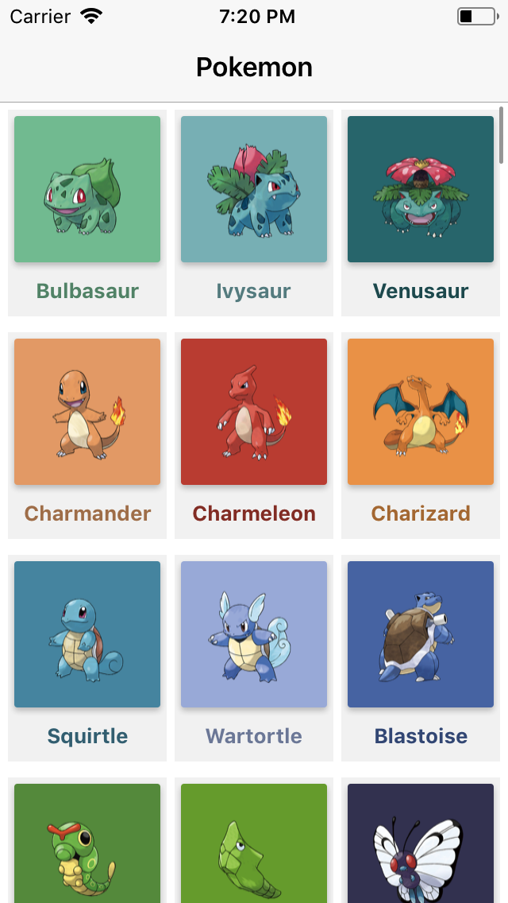
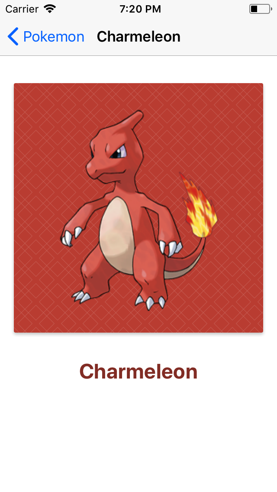
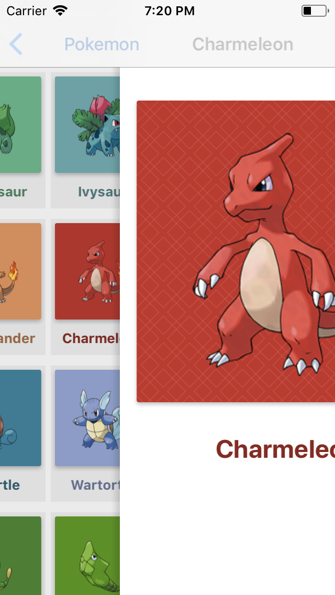
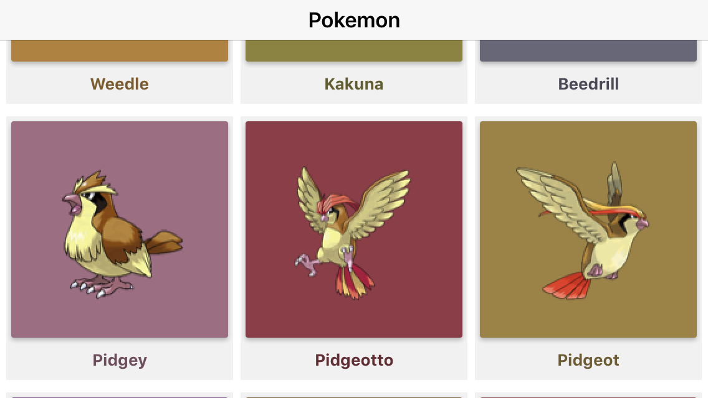
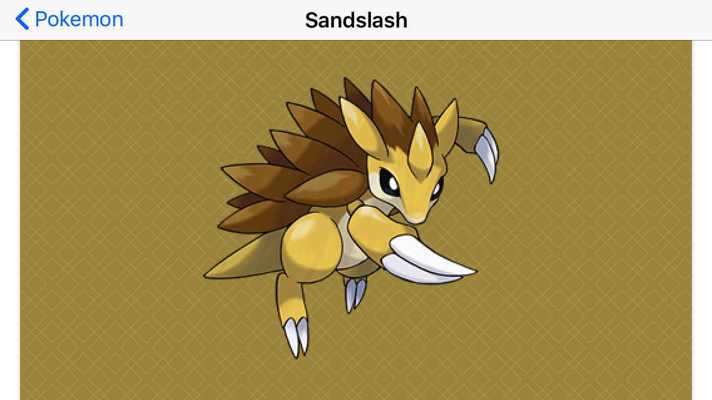

### Home Assignment #3

# Pokedex App: Part 1

### Opis zadania

Celem zadania jest stworzenie aplikacji o nazwie Pokedex. Pokedex wykorzystuje Pokemonową część API Switter'a – dokumentacja jest dostępna [tutaj](https://github.com/DaftMobile/switter)

**Pamiętajcie, że przyszłe zajęcia zaczniemy od tego projektu!**

Aplikacja zawiera **dwa** erkany:

1. Ekran listy Pokemonów (`UICollectionView` + `UICollectionViewFlowLayout`)
2. Erkan szczegółów jednego Pokemona (`UIScrollView`, `UIImageView`, `UILabel`)

Pokemony mają być pobierane z dedykowanego serwera – dokumentacja jest dostępna [tutaj](https://github.com/DaftMobile/switter).

### Wskazówki

1. Użyj `URLSession` do pobierania listy Pokemonów przy wejściu na pierwszy ekran. Użyj konfiguracji `ephemeral`.
2. Użyj [`Codable`](https://developer.apple.com/documentation/foundation/archives_and_serialization/encoding_and_decoding_custom_types) (nowy feature Swifta 4) aby sparsować odpowiedź serwera
3. Przeczytaj [dokumentację serwera]((https://github.com/DaftMobile/switter)) i pamiętaj o headerze `x-device-uuid` - użyj API [`UIDevice`](https://developer.apple.com/documentation/uikit/uidevice) i metody `identifierForVendor`
4. Pamiętaj żeby **NIGDY** nie korzystać z funkcji `UIKit` w Background Queue
5. Stwórz własną subclassę `UICollectionViewCell` (w Storyboardzie) i wykorzystaj ją później (pamiętaj o podpięciu klasy w Storyboardzie i podpinaniu Outletów). Pamiętaj o poprawnym skonfigurowaniu `reuseIdentifier`.
6. Potrzebujesz **trzech** ViewControllerów w Storyboardzie (`UINavigationController`, `PokemonListViewController`, `PokemonDetailsViewController`).
7. Cała logika wpisywania danych (tekst, pobranie obrazka, kolor) do `PokemonCollectionViewCell` powinna się odbywać w metodzie `collectionView(_:cellForItemAt:)`
8. Aby przejść do `PokemonDetailViewController` wystarczy użyć Segue w Storyboardzie. Sprawdź jak to zrobić [tutaj](https://developer.apple.com/library/content/featuredarticles/ViewControllerPGforiPhoneOS/UsingSegues.html)
9. Ustawienie modelu w `PokemonDetailViewController` powinno się odbywać w funkcji `func prepare(for segue: UIStoryboardSegue, sender: Any?)` zaimplementowanej w `PokemonListViewController` (to jest metoda wywołana żeby przygotować się do przejścia do nowego ekranu)
10. W czasie rozwiązywania zadania na 90% traficie na takiego buga: będziecie widzieć obrazki przedstawiające niepoprawnego Pokemona w `PokemonCollectionViewCell`. Podpowiedź: ten bug jest spowodowany mechanizmem dequeue. Przemyślcie jak to poprawnie rozwiązać.

### Kryteria oceny

1. Poprawny layout
2. CollectionView poprawnie użyte
3. Brak zapytań do API na głównym wątku
4. Poprawne pobieranie thumbnaili
5. Wyświetlanie details view controllera
6. Poprawne działanie przy poziomej orientacji

### Dla chętnych:

1. `UIMotionEffect` i pattern na ekranie szczegółów – da się to przetestować tylko na prawdziwych urządzeniach, a nie na symulatorze, więc próbujcie to zrobić tylko jeśli macie urządznia. Bardzo łatwe API do użycia – wystarczy zerknąć w dokumentację.

### Odpowiedzi

Odpowiedź (cały, spakowany w .zip folder projektu) wyślij mailem na adres [email](mailto:michal.dabrowski+assignment3@daftcode.pl) do końca najbliższej soboty: **02.12.2017, 23:59**.

Przypominam, że jest możliwość wykonania zadania w salce na MiMUW. Termin to **czwartek w godzinach 14:00 - 16:00**. Przyjdźcie w tym terminie – administratorzy uruchomią Wam system i będziecie mogli wykonać zadanie.
